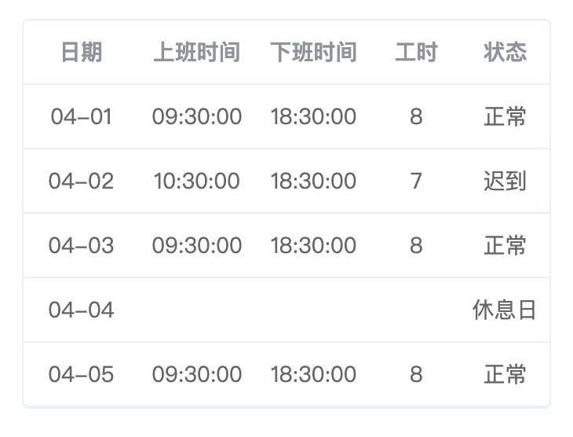
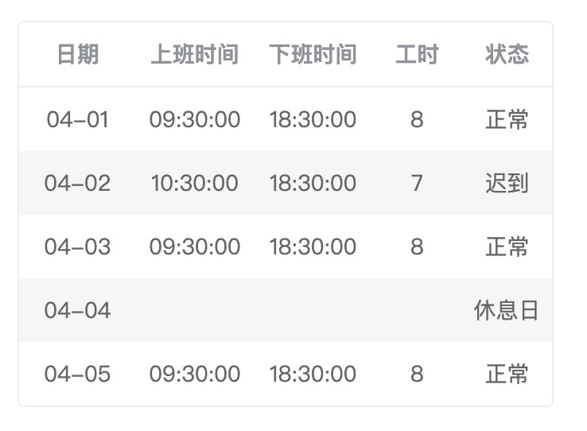
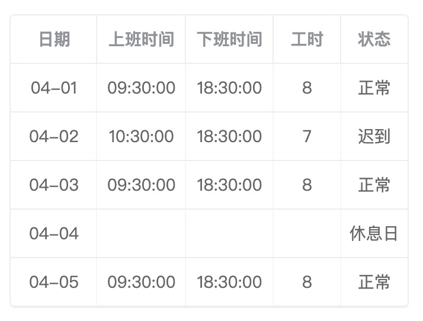
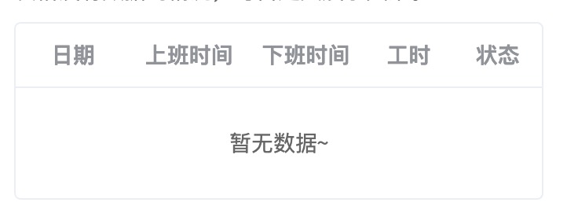
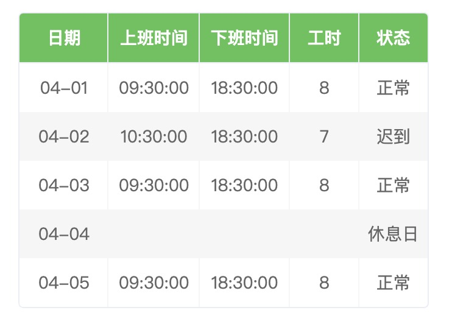
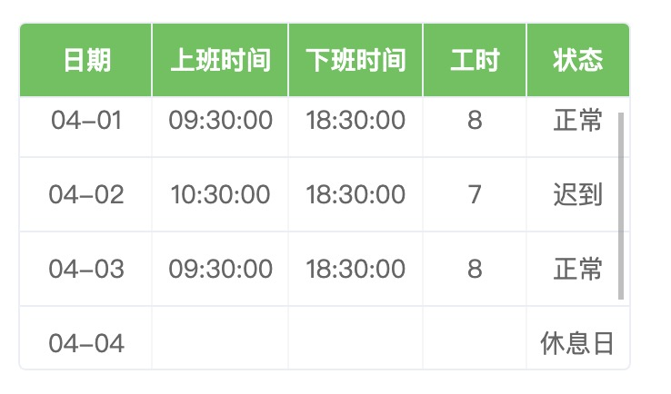
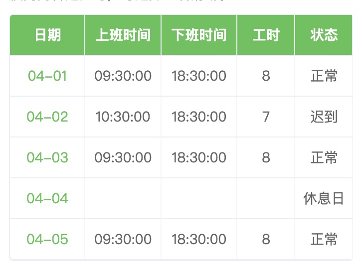
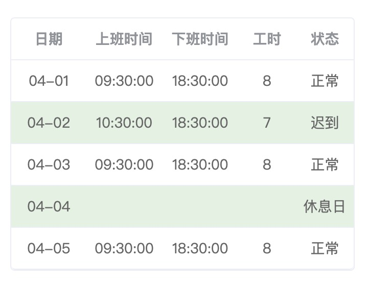

# miniprogram-table-component

小程序自定义table组件

> 使用此组件需要依赖小程序基础库 2.2.2 版本，同时依赖开发者工具的 npm 构建。具体详情可查阅[官方 npm 文档](https://github.com/wechat-miniprogram/miniprogram-custom-component/blob/master/README.md)。

## table组件效果展示

`miniprogram-table-component` 小程序自定义table组件
> 使用此组件需要依赖小程序基础库 2.2.2 版本，同时依赖开发者工具的 npm 构建。具体详情可查阅[官方 npm 文档](https://github.com/wechat-miniprogram/miniprogram-custom-component/blob/master/README.md)。

### 1.基础表格



### 2.带斑马纹表格



### 3.带间隔边框表格



### 4.自定义无数据的提示文案



### 5.自定义表格头样式



### 6.固定表头



### 7.表格横向滑动



### 8.自定义表格行和单元格样式



## 快速上手

一个简易的微信小程序 `table组件`诞生了。新鲜热乎的，上面看看展现效果，接下来介绍使用方法。
自定义的 table 组件，使用很简单，就是按照自定组件的用法使用。

### 1、安装和引入
- 安装组件： 
```
npm install --save miniprogram-table-component
```
- 引入table自定义组件

在页面的 json 配置文件中添加 recycle-view 和 recycle-item 自定义组件的配置

```json
{
  "usingComponents": {
    "table-view": "../../../miniprogram_npm/miniprogram-table-component"
  }
}
```

> 注意：npm包的路径。如果这里遇到找不到包的问题，可以查看下方的 `微信小程序 npm 找到不到npm包的坑？`

### 2、使用table组件

在wxml页面需要用到的地方使用，如下：

```html
<table 
    headers="{{tableHeader}}" 
    data="{{ row }}" 
    stripe="{{ stripe }}"
    border="{{ border }}"
/>
```

在js页面需要用到的地方使用，如下：

```javascript
Page({
  /**
   * 页面的初始数据
   */
  data: {
    tableHeader: [
      {
        prop: 'datetime',
        width: 150,
        label: '日期',
        color: '#55C355'
      },
      {
        prop: 'sign_in',
        width: 152,
        label: '上班时间'
      },
      {
        prop: 'sign_out',
        width: 152,
        label: '下班时间'
      },
      {
        prop: 'work_hour',
        width: 110,
        label: '工时'
      },
      {
        prop: 'statusText',
        width: 110,
        label: '状态'
      }
    ],
    stripe: true,
    border: true,
    outBorder: true,
    row: [
      {
          "id": 1,
          "status": '正常',
          "datetime": "04-01",
          "sign_in_time": '09:30:00',
          "sign_out_time": '18:30:00',
          "work_hour": 8,
      }, {
          "id": 2,
          "status": '迟到',
          "datetime": "04-02",
          "sign_in_time": '10:30:00',
          "sign_out_time": '18:30:00',
          "work_hour": 7,
      }, {
          "id": 29,
          "status": '正常',
          "datetime": "04-03",
          "sign_in_time": '09:30:00',
          "sign_out_time": '18:30:00',
          "work_hour": 8,
      }, {
          "id": 318,
          "status": '休息日',
          "datetime": "04-04",
          "sign_in_time": '',
          "sign_out_time": '',
          "work_hour": '',
      }, {
          "id": 319,
          "status": '正常',
          "datetime": "04-05",
          "sign_in_time": '09:30:00',
          "sign_out_time": '18:30:00',
          "work_hour": 8,
      }
    ],
    msg: '暂无数据'
  },

  /** 
   * 点击表格一行
   */
  onRowClick: function(e) {
    console.log('e: ', e)
  }
})
```


### 3、配置

配置部分主要配置这么几个属性，分别是：

配置项 | 说明 | 类型  | 可选值 | 默认值 | 必填
---|---|---|---|---|---
headers | 表格头部标题、列宽度、列属性 | Array | `{prop: 'datetime', width: 150, label: '日期'}` | [] | yes
data | 表格列表数据 | Array | | [] | no
stripe | 是否为斑马纹 | boolean | true/false | false | no
border | 是否有间隔线 | boolean | true/false | false | no
height | 纵向内容过多时，可选择设置高度固定表头。 | string |  | auto | no
msg | 固定无数据情况，展示文案 | string |  | `暂无数据～` | no
header-row-class-name | 自定义表格头样式 | string |  |  | no
row-class-name | 自定义表格行样式 | string |  |  | no
cell-class-name | 自定义单元格样式 | string |  | | no
bind:rowHandle | 行被点击时会触发该事件 | string |  | | no

配置相关代码🌰：

```javascript
<table  
      header-row-class-name="header-class"
      row-class-name="row-class"
      cell-class-name="cell-class"
      headers="{{tableHeader}}" 
      data="{{ row }}" 
      stripe="{{ stripe }}"
      height="{{ height }}"
      border="{{ border }}"
      bind:rowClick="onRowClick"
      bind:cellClick="onCellClick" 
      no-data-msg="{{ msg }}"
/> 
```
> `header-row-class-name`、`row-class-name`、`cell-class-name` 是通过externalClasses支持外部样式，在父组件中控制表格的样式，[externalClasses外部样式类, 官方说明](https://developers.weixin.qq.com/miniprogram/dev/framework/custom-component/wxml-wxss.html)。例子源码通过[github地址](https://github.com/habc0807/miniprogram-table-component)查看。

## 实现一个自定义表格组件遇到的坑

### npm 登录不上和发布不了的问题?

之前也发布过 npm 包，遗忘了 `npm login` 登录不上需要将淘宝镜像改回npm的。还有一点需要注意的是，每次发布都需要更新 `package.json` 文件里的版本号。

### 微信小程序 npm 找到不到npm包的坑？

组件开发完，引入使用的时候，发现npm的包，找不到了？这里比较坑的是小程序的npm有特殊的使用方式。

- 首先在项目的根目录初始化 npm:

```
npm init -f 
```
- 然后安装对应的自定义组件包

```
npm install -production miniprogram-table-component
```
> npm/cnpm/yarn add 均可

- 在微信开发者工具中，设置 —> 项目设置—> 勾选使用npm模块。

- 在微信开发者工具中，工具 —> 构建npm，构建完成会生成 `miniprogram_npm` 文件夹，项目用到的npm包都在这里。
- 按照自己的使用路径，从 `miniprogram_npm` 引入需要的包。


## 源码

- [npm地址](https://www.npmjs.com/package/miniprogram-table-component)
- [github地址](https://github.com/habc0807/miniprogram-table-component)

